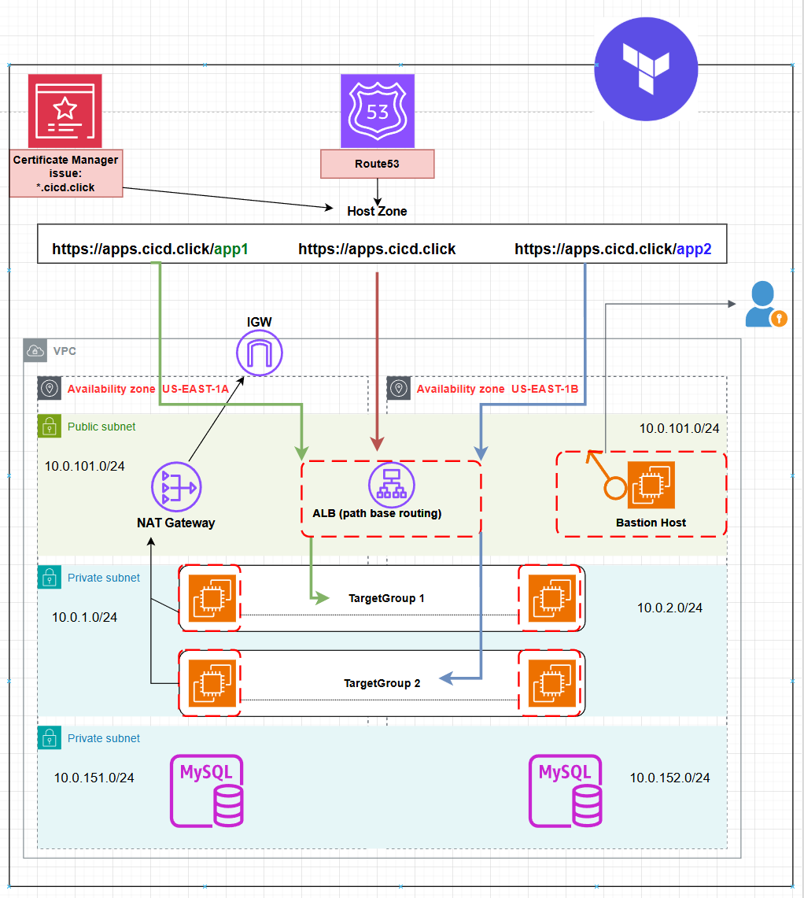

# terraform-aws-3tier-alb-path-routing



This repository provisions a **3-tier AWS VPC** with:

* **4 private EC2 instances** (2 per private subnet)
* **Bastion Host** for secure SSH
* **Application Load Balancer (ALB)** with **path-based routing**
* **ACM SSL certificate**
* **HTTP → HTTPS redirection**
* **Route53 alias record**: `apps.cicd.click`

This setup is ideal for hosting **multi-app deployments** securely with isolated private instances behind a public entry point.

---

## Architecture Overview

* **VPC:** 10.0.0.0/16 across **2 Availability Zones** (`us-east-1a` and `us-east-1b`)
* **Subnets:**

  * **Public:** Bastion + IGW
  * **Private App:** 4 EC2 instances (2 per AZ)
  * **Private DB:** Fully isolated
* **ALB:**

  * Listens on **HTTP (80)** and **HTTPS (443)**
  * **HTTP → HTTPS redirect**
  * **Path-based routing:**

    * `/app1*` → **Target Group 1 (TG1)**
    * `/app2*` → **Target Group 2 (TG2)**
    * `/` → **fixed response**: "Fixed Static message - for Root Context"
* **Security Groups:** Bastion, private EC2s, ALB
* **DNS:** `apps.cicd.click` points to ALB via Route53

---

## Terraform Modules Used

* **terraform-aws-modules/vpc/aws** – VPC, subnets, IGW, NAT Gateway
* **terraform-aws-modules/security-group/aws** – SGs for Bastion, private EC2s, ALB
* **terraform-aws-modules/ec2-instance/aws** – Bastion and 4 private EC2s
* **terraform-aws-modules/alb/aws** – ALB, target groups, listeners
* **terraform-aws-modules/acm/aws** – ACM SSL certificate
* **aws_route53_record** – Route53 alias record

---

## Deployment Steps

1. Clone the repository:

```
git clone <your-repo-url>
cd terraform-aws-3tier-alb-path-routing
```

2. Place your private key:

```
private-key/mmd-admin-key-us-east-1.pem
```

3. Initialize Terraform:

```
terraform init
```

4. Review the plan:

```
terraform plan
```

5. Apply the configuration:

```
terraform apply
```

Type `yes` to confirm.

---

## Access Instructions

* **SSH Bastion:**

```
ssh -i "private-key/mmd-admin-key-us-east-1.pem" ec2-user@<BASTION_PUBLIC_IP>
```

* **SSH Private EC2 (via Bastion):**

```
ssh -i "/tmp/mmd-admin-key-us-east-1.pem" ec2-user@<PRIVATE_INSTANCE_IP>
```

* **Access Applications via ALB:**

| Path    | Target        |
| ------- | ------------- |
| `/app1` | TG1 → App1    |
| `/app2` | TG2 → App2    |
| `/`     | Fixed message |

---

## ALB Configuration

* **Listeners:**

  * HTTP (80) → Redirect to HTTPS (443)
  * HTTPS (443) → TLS13, ACM certificate applied
  * Fixed response for `/`
  * Path-based routing rules for `/app1*` and `/app2*`
* **Target Groups:**

  * **TG1** → Private EC2 app1 instances, health check `/app1/index.html`
  * **TG2** → Private EC2 app2 instances, health check `/app2/index.html`
* **Target Attachments:** Attached using `aws_lb_target_group_attachment` per EC2 instance

---

## Security Groups

* **Bastion SG:** SSH 22 from anywhere
* **Private EC2 SG:** SSH 22 & HTTP 80 from VPC CIDR only
* **ALB SG:** HTTP 80 & HTTPS 443 from Internet, backend traffic to private EC2s

---

## ACM Certificate

* **Domain:** `*.cicd.click`
* **Validation:** DNS validation using Route53
* **Used by ALB HTTPS listener**

---

## Route53

* **Record:** `apps.cicd.click` (A record alias to ALB DNS)
* **Zone:** Existing hosted zone `cicd.click`

---

## Outputs

* **VPC & Subnets:** `vpc_id`, `public_subnets`, `private_subnets`
* **Bastion & Private EC2s:** `ec2_bastion_public_ip`, `ec2_private_instance_ids`
* **ALB:** `id`, `arn`, `dns_name`, `zone_id`, `listeners`, `listener_rules`, `target_groups`
* **Security Group:** `security_group_id`, `security_group_arn`
* **ACM Certificate:** `cicd_domain_certificate_arn`
* **Route53:** `route53_apps_record`, `mydomain_zoneid`, `mydomain_name`

```


